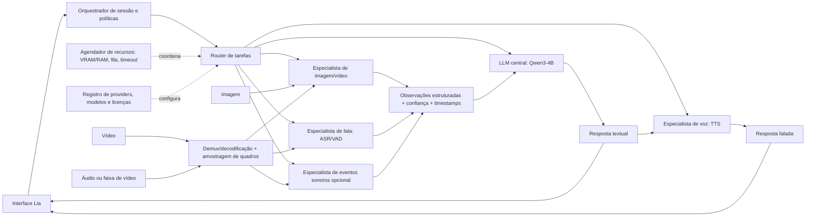

# Arquitetura modular Omni — proposta documental

**Estado:** proposta, sem código executável, downloads ou instalações. O Qwen3-4B Q4_K_M está selecionado como base textual da prova de conceito; sua inferência Vulkan foi confirmada em `benchmark-results/lia-llm-comparison-20260930-085425.json`. Isso não valida os especialistas abaixo: todos permanecem candidatos documentais.

## Objetivos e limites

- Manter um único **orquestrador de conversa** apoiado no Qwen3-4B e plugar especialistas independentes para percepção e geração de mídia.
- Permitir trocar qualquer modelo ou runtime por trás de uma interface estável, sem fundir pesos nem atrelar a aplicação a um fornecedor.
- Executar localmente e sob demanda; preservar timestamps e proveniência de saídas; solicitar permissão explícita antes de abrir microfone/câmera.
- Fazer apenas avaliação documental nesta fase. Não baixar pesos, instalar dependências, compilar runtimes nem atualizar o llama.cpp sem confirmação adequada.
- Não alegar capacidade Omni até cada combinação modelo/runtime/modalidade passar uma prova end-to-end no Windows e no hardware-alvo.

## Componentes lógicos



## Contrato entre módulos

Cada adapter deverá anunciar `id`, versão, modalidades aceitas/produzidas, idiomas, runtime/backend, custo aproximado de memória e limites conhecidos. Interface lógica mínima:

- `health()` e `capabilities()` para expor prontidão e suporte real da implementação, não apenas o do modelo.
- `load()`/`unload()` explícitos para o agendador liberar VRAM quando um especialista não estiver em uso.
- Uma operação tipada por tarefa — por exemplo `describe_image`, `transcribe_audio`, `classify_audio`, `analyze_video` ou `synthesize_speech` — em vez de um `predict()` genérico.
- Resultado com `content`, `timestamps`, `language`, `confidence`, `warnings` e `provider_id`. Confiança pode estar ausente; não inventar probabilidades se o backend não as oferece.
- Erros de modalidade/runtime retornados como erro tipado. O orquestrador pode degradar para texto ou perguntar ao usuário, mas nunca fingir que uma modalidade foi processada.

Envelope comum de entrada:

```json
{
  "session_id": "...",
  "modality": "audio|image|video|text",
  "source": "file|live_capture",
  "uri": "...",
  "captured_at": "ISO-8601 ou null",
  "retain_source": false,
  "locale": "pt-BR"
}
```

O envelope é uma proposta de API, não uma implementação. Para vídeo, guardar timestamps de origem por segmento/quadros e alinhar a transcrição à mesma linha do tempo. Para fala, separar a transcrição literal da interpretação do LLM.

## Fluxos de referência

### Conversa por texto

1. A interface cria sessão e envia texto ao orquestrador.
2. O router chama Qwen3-4B e transmite a resposta textual.
3. TTS é opcional e só é chamado após pedido/configuração de voz. Uma falha no TTS não deve cancelar a resposta textual.

### Imagem

1. Usuário seleciona imagem ou concede acesso explícito à câmera.
2. O adapter de visão retorna descrição/OCR/objetos relevantes como observações marcadas com confiança e limitações.
3. O LLM responde com base nas observações e indica incerteza; o arquivo não é retido por padrão.

### Fala e áudio não verbal

1. A captura começa apenas com permissão visível; VAD pode delimitar trechos.
2. ASR retorna texto, idioma e tempos. Um classificador de eventos sonoros separado pode, se necessário, rotular sons não verbais; não substituir ASR por classificação de áudio.
3. O orquestrador entrega observações e timestamps ao LLM. Silêncio, áudio incerto e falha de microfone têm estados próprios.

### Vídeo com áudio

1. Um demux/decoder separa faixa sonora e quadros, conservando offsets/timestamps.
2. A amostragem de quadros limita taxa/resolução antes do especialista visual; áudio segue por ASR e, se habilitado, pelo classificador de eventos.
3. O LLM recebe resumo sincronizado, não um blob opaco; a interface mostra a origem temporal das observações.
4. Não prometer compreensão contínua ou ao vivo até latência, sincronização e cobertura serem testadas.

## Gestão de memória e execução

- Tratar a RX 580 como recurso compartilhado e variável, não como 8 GiB garantidos para modelos. A enumeração do diagnóstico apresentou 7367 MiB livres antes do teste; o Qwen3-4B registrou 2375,91 MiB de model buffer Vulkan, 576 MiB de KV e 79,01 MiB de compute, além de memória host.
- Começar com **um especialista pesado na GPU por vez**. O scheduler serializa cargas, descarrega especialistas ociosos quando suportado, aplica limites e verifica memória antes de chamar a inferência.
- Contexto, resolução, número de quadros, duração do áudio, batch e caches têm limites configuráveis. Rejeitar ou pedir redução para arquivos acima dos limites em vez de provocar OOM.
- Registrar por tarefa memória livre antes/depois, latência de carregamento e inferência, modo CPU/GPU e erros. Não inferir uso da GPU apenas pela enumeração do dispositivo.
- Permitir fallback CPU apenas se a latência e o orçamento de RAM forem aceitáveis, e informar ao usuário qual backend executou.

## Triagem documental de especialistas

| Função | Candidato para investigar | Evidência publicada e licença | Riscos / decisão atual |
|---|---|---|---|
| **LLM de texto/orquestração** | Qwen3-4B Instruct 2507 Q4_K_M | Apache-2.0 conforme metadados GGUF; cinco tarefas funcionais passaram na comparação; diagnóstico observou 37/37 camadas no Vulkan da RX 580. | **Selecionado para a prova de conceito textual**, não como modelo Omni; o contrato modular permite substituí-lo. |
| **Imagem e descrição de vídeo** | HuggingFaceTB/SmolVLM2-500M-Video-Instruct | Model card declara entrada de imagem/vídeo + texto e saída de texto, checkpoint Apache-2.0 e cerca de 1,8 GB de GPU para a inferência de vídeo documentada. | Não executado localmente; requisito e backend referem-se à rota do model card, não ao runtime instalado da Lia. É indicado como inglês; qualidade PT-BR, Windows/Vulkan, contexto de quadros e memória real precisam de teste. Candidato de triagem, não escolha final. |
| **Reconhecimento de fala (ASR)** | `whisper.cpp` com modelo Whisper pequeno apropriado | Projeto C/C++ MIT, lista Windows e suporte Vulkan quando compilado com `GGML_VULKAN`. | A issue oficial de fevereiro de 2026 registra que binários Windows Vulkan não seriam adicionados aos releases. Não instalar nem compilar nesta fase. Licença/procedência dos pesos deve ser confirmada separadamente da licença do código; teste PT-BR e latência pendentes. |
| **Eventos de áudio não verbal** | YAMNet como baseline documental opcional | O projeto TensorFlow descreve 521 classes de eventos, entrada mono 16 kHz e cerca de 3,7M de parâmetros; código sob Apache-2.0. | Não substitui ASR. A documentação disponível aponta uma implementação antiga e questões de compatibilidade; conferir licença/procedência dos pesos e implicações do AudioSet, além de runtime no Windows, antes de considerar qualquer teste. |
| **Voz de saída (TTS)** | Kokoro-82M v1.0 | Model card informa pesos Apache-2.0 e três vozes de português brasileiro (`pf_dora`, `pm_alex`, `pm_santa`). | O próprio VOICES.md alerta que idiomas não ingleses podem ter dados G2P/treino limitados; as vozes PT não têm nota de qualidade publicada ali. A cadeia de inferência inclui dependências com licenças próprias, inclusive `espeak-ng` GPLv3 segundo o card. Escutar e revisar dependências/voz antes de escolher. |
| **Decodificação de vídeo/áudio** | FFmpeg em configuração LGPL | O projeto publica licença LGPL 2.1+; opções GPL mudam as obrigações e a licença resultante. | Decoder/utilitário, não modelo. Se/quando distribuir, conferir build, codecs habilitados e avisos legais; nenhuma build foi selecionada ou instalada. |

Fontes oficiais e primárias estão em [`OMNI-COMPATIBILITY-MATRIX.md`](OMNI-COMPATIBILITY-MATRIX.md#fontes). A presença de candidato nesta tabela não significa autorização para instalar seu runtime ou baixar seus pesos nesta etapa.

## Plano de prova de conceito, sem executar agora

1. Fechar a especificação da API de módulos e limites de privacidade/recursos; escolher amostras locais de teste curtas e autorizadas.
2. Para cada candidato, revisar separadamente licença de código, pesos, vozes e dados, formato, manutenção e rota de execução Windows. Só então decidir que recurso testar; registrar origem, revisão, hash e caminho externo antes de qualquer download.
3. Se o runtime necessário não estiver já instalado, solicitar autorização antes de instalação/atualização ou compilação. Preferir primeiro um módulo que possa usar ferramentas já presentes.
4. Validar especialistas isoladamente com amostras controladas; em seguida validar um fluxo integrado por vez. Registrar latência, RAM/VRAM, backend efetivo, qualidade PT-BR, falhas e limitações.
5. Não habilitar captura contínua de câmera/microfone, retenção de mídia ou envio à rede sem consentimento e controles visíveis.
